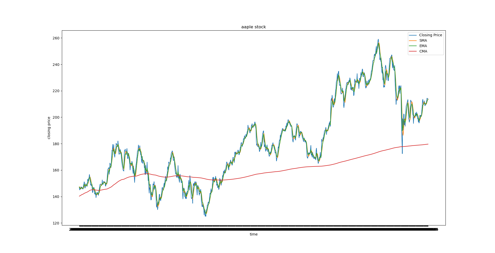
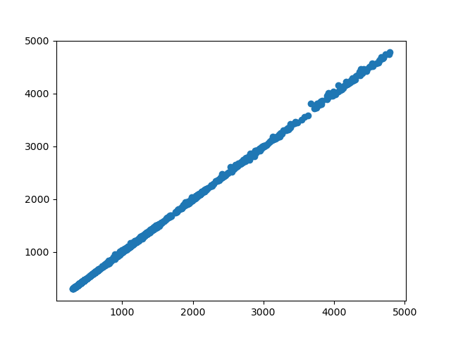
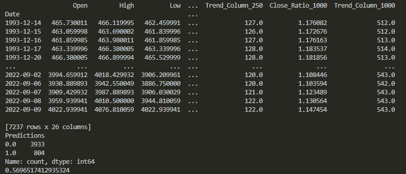

# Stock Price Predictor

This project is a practice implementation to learn and demonstrate core concepts of AI and machine learning using historical S&P 500 stock data.

## Features

- Loads and processes historical S&P 500 data from CSV.
- Computes rolling averages, returns, and other technical indicators.
- Implements and compares Linear Regression and Random Forest models for price prediction and classification.
- Visualizes actual vs predicted prices and error distributions.
- Includes backtesting for model evaluation.

## Project Details

- **Data Source:** Historical S&P 500 data, downloaded via the Tiingo API. See [Tiingo](https://www.tiingo.com/) for more information.
- **Data Range:** The dataset covers daily prices from 1950 onwards.
- **Preprocessing:** The script computes several rolling averages (7, 30 days), simple/expanding/exponential moving averages, lagged features, and target variables for both regression and classification tasks.
- **Models Used:** Linear Regression for price prediction and Random Forest for classification of price movement direction.
- **Backtesting:** The Random Forest classifier is evaluated using a rolling-window backtest to simulate real-world trading conditions.

## Usage

1. Create and activate a conda environment, then install dependencies:
    ```sh
    conda create -n stock-predictor python=3.11
    conda activate stock-predictor
    pip install -r requirements.txt
    ```
2. Set your Tiingo API key in a `.env` file:
    ```
    TIINGO_API_KEY=your_api_key_here
    ```
3. Run the main script:
    ```sh
    python [main.py]
    ```

## Example Output

- Scatter plot of actual vs predicted prices (Linear Regression)
- Histogram of prediction errors
- Precision score for Random Forest classification





## References

- [Tiingo API Documentation](https://www.tiingo.com/documentation/end-of-day)
- [Linear Regression Video](https://www.youtube.com/watch?v=1O_BenficgE)

---

*This project is for educational purposes only